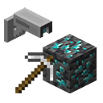

## MinerTrack Anti-XRay

   

   

**MinerTrack** is a plugin that will really help you catch those naughty players using Xray on your server in a **different way** from other Anti-Xray plugins. This plugin doesn't hide ores, as hiding ores requires a lot of resources.

*So how does it work?*

To catch Xray, MinerTrack uses an **advanced algorithm** that combines **several factors** like ore scarcity, the amount of ores mined in a certain period, the player’s path to ores, and many other aspects.

*But can't people still use Xray?*

Yes and no. Indeed, a player using Xray has two options:
1. Keep using Xray but behave like a normal player to avoid being caught. They can't get more ores than a normal player or they’ll be caught by MinerTrack.
2. Uninstall their Xray or be caught.

*Why choose MinerTrack over other AntiXray options?*

Compared to Paper Anti-XRay and Orebfuscator:
- MinerTrack is lightweight.
- MinerTrack's engine is innovative.
- MinerTrack detects Xray users, leaving it to you to decide on sanctions.

Compared to other AntiXray solutions:
- MinerTrack supports the latest Minecraft version.
- MinerTrack has been tested on servers with about 20 simultaneous players, with very few false positives (*default config*).
- MinerTrack is free.

- Detect XRayer
- Automatically handle cases when a player's X-Ray violation level reaches a threshold
- Automatically reduce the violation level when the player's behavior normalizes
- Analyze player mining paths to detect X-Ray usage
- When the player is mining in a cave, they will not be detected incorrectly
- Highly configurable profiles

- `/mtrack notify <message>` - Send alerts to staff
- `/mtrack verbose` - Enable Detailed Mode and notify staff with it enabled whenever a player’s violation level increases
- `/mtrack check <player>` - Check a player’s violation history
- `/mtrack reset <player>` - Reset a player's violation record
- `/mtrack help` - Get plugin help
- `/mtrack kick <player> <reason>` - Kick a player with a specific reason
- `/mtrack reload` - Reload the plugin’s configuration
- `/mtrack update` - Check for plugin updates

- `minertrack.bypass` - Bypass X-Ray detection
- `minertrack.notify` - Receive notifications and verbose information
- `minertrack.checkupdate` - Receive update information and use `/mtrack update`
- `minertrack.use` - Access the root command `/mtrack`
- `minertrack.check` - Use `/mtrack check`
- `minertrack.kick` - Use `/mtrack kick`
- `minertrack.help` - Use `/mtrack help`
- `minertrack.reset` - Use `/mtrack reset`
- `minertrack.sendnotify` - Use `/mtrack notify`
- `minertrack.verbose` - Use `/mtrack verbose`
- `minertrack.reload` - Use `/mtrack reload`

1. Download the latest version of **MinerTrack** from SpigotMC.
2. Place the .jar file into the plugins folder.
3. Restart the server to generate the configuration and necessary files.

- Java 17 or higher
- Paper, Purpur, Folia or compatible forks (1.18 or newer) *Not Spigot!*

If you encounter any issues or have suggestions for new features, feel free to reach out via SpigotMC or open an issue on the plugin’s GitHub repository.

**Join Our Discord: https://discord.gg/MzTea2W9cb**

---

### *If you like this plugin, don’t forget to give a 5-star rating!*
